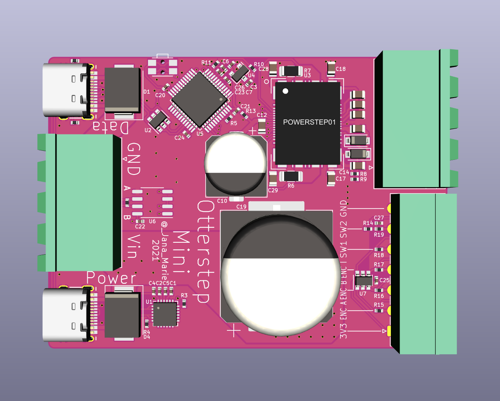
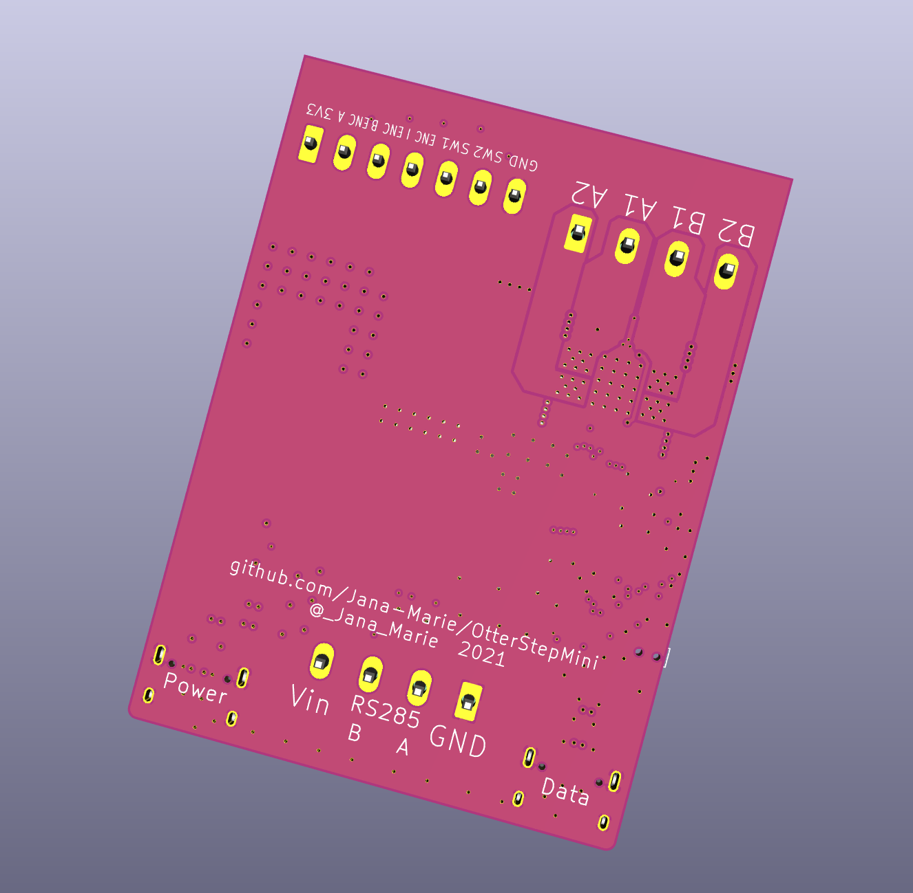

# OtterStepMini

OtterStepMini is a user friendly, up to 48V 10A stepper-motor-driver. It can be controlled via RS485 or USB-CDC and also comes with a 100W USB-PD input, for extra convinience on stepper-motor testing and for small desktop applications (e.g. 3D-scanner turntable).

The board has not been tested and should not be ordered yet.

